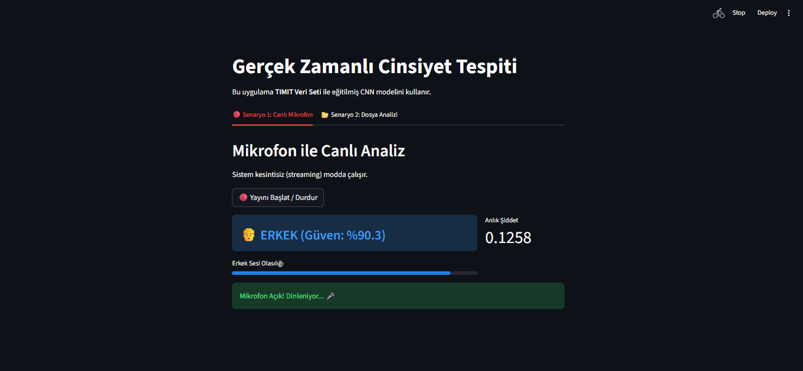
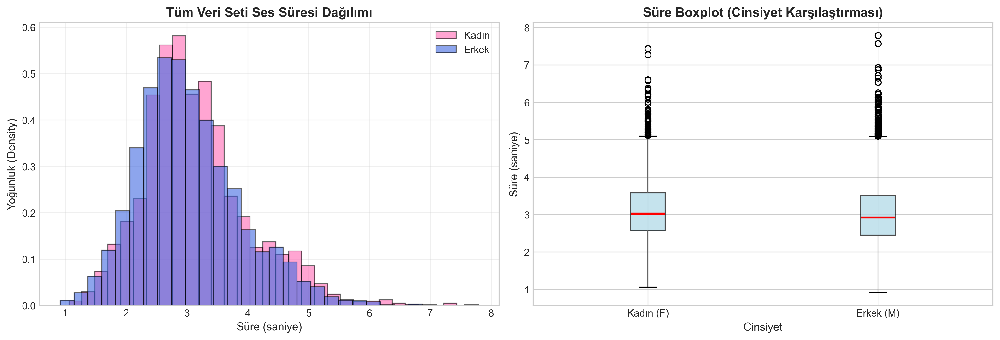
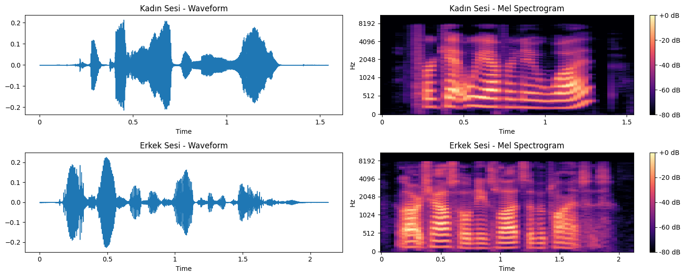
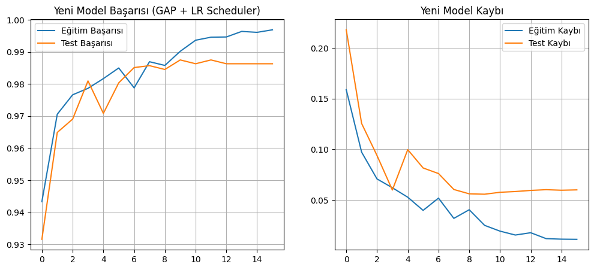
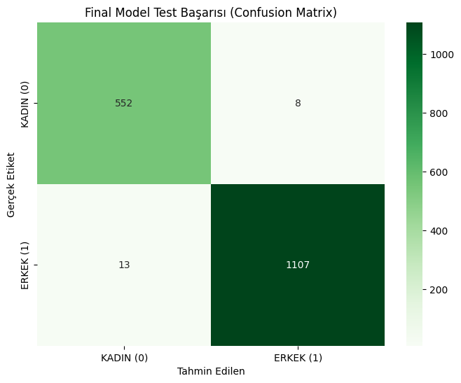

# 🎙️ SafeSpeech Case: Real-Time Gender Recognition System


> **TIMIT Veri Seti** ile eğitilmiş, uçtan uca Derin Öğrenme (CNN) tabanlı ve **gerçek zamanlı (real-time)** çalışan cinsiyet tespit sistemi.

---

## 📱 Uygulama Önizlemesi

Sistem, canlı mikrofon verisini veya yüklediğiniz ses dosyasını işleyerek anlık cinsiyet tahmini yapar.



---

## 📂 Proje Yapısı

Repoyu bilgisayarınıza indirdiğinizde klasör yapısı aşağıdaki gibi görünmelidir:

```
Safespeech-Case/
│
├── README.md                
├── assets/                  
│   └── app_screenshot.png
│    ...
│
└── case_app/                # Uygulama ana klasörü
    ├── app.py               # Streamlit uygulama dosyası
    ├── requirements.txt     # Gerekli kütüphane listesi
    ├── models/              # Eğitilmiş model klasörü
    │   └── best_model_v2.keras
```

---

## 🚀 Kurulum ve Çalıştırma

Projeyi yerel makinenizde (Localhost) çalıştırmak için aşağıdaki adımları izleyin.

### 1. Repoyu Klonlayın

Projeyi bilgisayarınıza indirin ve proje dizinine girin:

```bash
git clone https://github.com/EGuseinov/Safespeech-Case.git
cd Safespeech-Case/case_app
```

### 2. Sanal Ortam (Virtual Environment) Oluşturun

Bağımlılıkların sistem geneline yayılmaması için izole bir ortam kurun:

**Windows için:**

```bash
python -m venv venv
venv\Scripts\activate
```

**Mac / Linux için:**

```bash
python3 -m venv venv
source venv/bin/activate
```

### 3. Gerekli Kütüphaneleri Yükleyin

requirements.txt dosyasındaki paketleri kurun:

```bash
pip install -r requirements.txt
```

> **Not:** Sisteminizde ffmpeg kurulu değilse MP3/OGG dosyalarını okurken hata alabilirsiniz. Windows kullanıcıları için genellikle pip kurulumu yeterlidir, ancak Linux kullanıcılarının aşağıdaki komutu çalıştırması gerekebilir:

```bash
sudo apt-get install ffmpeg
```

### 4. Uygulamayı Başlatın

Streamlit arayüzünü ayağa kaldırın:

```bash
streamlit run app.py
```

Komutu çalıştırdıktan sonra tarayıcınızda otomatik olarak şu adres açılacaktır:

```
http://localhost:8501
```

---

## 📋 Gereksinimler

Tüm gereksinimler `requirements.txt` dosyasında listelenmiştir.

---
## 🎯 Kullanım Örneği

### Canlı Mikrofon Kullanarak

1. Uygulamayı başlatın
2. "Başlat" butonuna basın
3. Mikrofona konuşun
4. Sistem otomatik olarak cinsiyet tahmini yapar

### Ses Dosyası Yükleyerek

1. "Dosya Yükle" seçeneğini seçin
2. Bilgisayarınızdan belirtilen formatlarda ses dosyası seçin
3. Sistem dosyayı işleyip sonucu gösterir

---
## 🛠️ Uygulanan Mühendislik Adımları
# Notebook Açıklaması – TIMIT Gender Classification

Bu notebook, TIMIT veri seti üzerinde **cinsiyet sınıflandırması** yapan, uçtan uca çalışan bir ses işleme pipeline'ı içerir. Aşağıdaki adımlar veri işleme, veri artırma, modelleme ve değerlendirme süreçlerini ayrıntılı olarak açıklar.

---

## 1. Çalışma Ortamı ve Bağımlılıklar

Notebook başında kullandığı ortam:

- **Python 3.12**
- **NumPy, Pandas, Matplotlib, Seaborn**
- **Librosa** (ses işleme)
- **TensorFlow / Keras** (model ve tf.data pipeline)
- **PyTorch** yalnızca ortam kontrolü için

Bu bölüm, hem **reprodüksiyon** hem de **bağımlılık yönetimi** açısından ortamın dokümante edilmesini sağlar.

---

## 2. Veri Seti ve NIST → WAV Dönüşümü

TIMIT_READY veri seti Kaggle dizininden okunur:

- **Orijinal veri formatı:** NIST SPHERE (.WAV)
- **Problem:** TensorFlow bu formatı doğrudan okuyamaz
- **Çözüm:** Standart RIFF WAV (PCM16) formatına dönüştürülür

### Uygulama Adımları

```
OLDBASE_DIR = "/kaggle/input/timit-ready/TIMIT_READY"
NEW_BASE_DIR = "/kaggle/working/TIMIT_FIXED"
```

1. `soundfile` ile her `.WAV` dosyası okunur
2. PCM16 formatında yeniden kaydedilir
3. TRAIN / TEST ve FEMALE / MALE klasör yapısı korunur:
   - TIMIT_FIXED/TRAIN/FEMALE
   - TIMIT_FIXED/TRAIN/MALE
   - TIMIT_FIXED/TEST/FEMALE
   - TIMIT_FIXED/TEST/MALE
4. Dönüşüm daha önce yapıldıysa tekrar çalışmaması için kontrol mekanizması vardır

**Sonuç:** TensorFlow ile uyumlu, standart WAV dosyalarına sahip bir klasör yapısı elde edilir.

---

## 3. Keşifsel Veri Analizi (EDA)

### 3.1. Ses Süresi Analizi

Tüm eğitim seti dolaşılıp her wav dosyasının süresi `librosa.get_duration` ile hesaplanır:

Metrik | Değer
-------|-------
Toplam dosya sayısı | 4620
Ortalama süre | ≈ 3.07 s
Maksimum süre | ≈ 7.79 s
%95 persentil | ≈ 4.70 s

**Tasarım Kararı:** Model tarafında **5 saniyelik üst sınır (MAX_SAMPLES = 80000 @ 16 kHz)** belirlenir. Böylece veri kırpma/padleme mantığı bu istatistiklere dayandırılır.

Görsel: 

### 3.2. Frekans Özellikleri – Spektral Merkez

Cinsiyetler arası frekans farkını görmek için **spektral centroid (ortalama frekans merkezi)** çıkarılır:

1. Her dosya için `librosa.feature.spectral_centroid` hesaplanır
2. Sonuçlar Pandas DataFrame'e alınır ve görselleştirilir:
   - Histogram (kadın/erkek üst üste)
   - Cinsiyete göre boxplot

**Bulgu:** Kadın seslerinin genel olarak daha yüksek spektral merkeze sahip olduğu gözlemlenmiştir. Bu, modelin neden ayrım yapabildiğini sezgisel olarak açıklar.

---

## 4. Örnek Dalga Formu ve Mel-Spektrogramlar

Kadın ve erkek için birer örnek ses seçilir:

- **Dalga formu** (waveshow)
- **128 kanallı Mel-spektrogram** (librosa.feature.melspectrogram + power_to_db)

Bu sayede veri işleme adımlarından önce, **ham sinyalin ve frekans dağılımının nasıl göründüğü** gözlemlenir.

Görsel: 

---

## 5. Ses Uzunluğunun Sabitlenmesi ve Örnekleme

### Model Girdisi Spesifikasyonu

Parametre | Değer
----------|------
Örnekleme frekansı | 16 kHz
Maksimum süre | 5 s
MAX_SAMPLES | 80000

### `loadaudio(filepath, label)` Fonksiyonu

1. Dosyayı `tf.audio.decode_wav` ile okur ve mono kanala indirger
2. Uzunluğa göre iki işlemden birini yapar:
   - **Uzunsa:** Rastgele bir başlangıç noktası seçip 5 saniyelik bir pencere keser (random crop)
   - **Kısaysa:** Sonuna sıfır pad ekleyerek 5 saniyeye tamamlar
3. **Çıkış:** `(audio_tensor, label)` – sabit uzunluklu 1D float32 tensör

---

## 6. Log-Spektrogram Dönüşümü

### `to_spectrogram(audio, label)` Adımları

```
1. STFT: tf.signal.stft(audio, frame_length=255, frame_step=128)
   ↓
2. Genlik: tf.abs(spectrogram)
   ↓
3. Log dönüşümü: tf.math.log(spectrogram + 1e-6)
   ↓
4. Görüntü boyutuna ölçekleme: tf.image.resize(..., (128, 128))
   ↓
5. Kanal boyutu ekleme: (128, 128, 1) formatına getirme
```

**Sonuç:** Ses sinyali CNN için uygun, **görüntü benzeri** bir girdiye dönüştürülür.

---

## 7. Veri Seti Oluşturma (tf.data Pipeline)

### 7.1. Dosya Yollarının Toplanması

`get_file_paths_and_labels(directory)` fonksiyonu:

- TRAIN / TEST klasörlerini dolaşır
- Etiketleme: `FEMALE → 0`, `MALE → 1`
- Döndürülen değerler:
  - `train_paths_list`, `train_labels_list`
  - `test_paths_list`, `test_labels_list`

### 7.2. Eğitim ve Test Pipeline'ı

```
ds_files = tf.data.Dataset.from_tensor_slices((train_paths, train_labels))
```

#### Eğitim

```
ds_original = ds_files.map(load_audio)
ds_noise = ds_files.map(load_audio → get_white_noise_audio)
ds_reverb = ds_files.map(load_audio → get_reverb_audio)

ds_train_full = ds_original
              .concatenate(ds_noise)
              .concatenate(ds_reverb)
              .map(to_spectrogram)
              .map(freq_masking)
              .shuffle(2000)
              .batch(BATCH_SIZE)
              .cache()
              .prefetch(AUTOTUNE)
```

#### Test

```
ds_test = ds_test_files.map(load_audio)
                       .map(to_spectrogram)
                       .batch(BATCH_SIZE)
                       .cache()
                       .prefetch(AUTOTUNE)
```
---

## 8. Veri Artırma (Data Augmentation) Stratejisi

Hem **dalga formu düzeyinde**, hem de **spektrogram düzeyinde** augment yapılıyor.

### 8.1. Dalga Formu Üzerinde Augmentation

#### Beyaz Gürültü Ekleme – `get_white_noise_audio`

```
# tf.random.normal ile düşük genlikli gürültü
noise = tf.random.normal(shape=tf.shape(audio))
audio_noisy = audio + noise_factor * 0.008  # noise_factor ≈ 0.008
```

**Amaç:** Mikrofon gürültüsü, ortam sesi gibi varyasyonlara karşı **gürbüzlük** (robustness)

#### Reverb / Yankı Simülasyonu – `get_reverb_audio`

```
# Basit "delay-and-sum" yaklaşımı
delay_samples = 4000
delayed_audio = tf.concat([tf.zeros(delay_samples), audio[:-delay_samples]], axis=0)
audio_reverb = audio + 0.3 * delayed_audio  # Sesin gecikmeli kopyası eklenir
```

**Amaç:** Farklı oda akustiği ve yankı koşullarını taklit etmek

### 8.2. Augmentation Oranları

Bu iki akış orijinal ile birlikte birleştiriliyor:

Veri Türü | Sayı
----------|-----
Orijinal | 4620
Gürültülü | 4620
Reverb'lü | 4620
**Toplam** | **13860**

### 8.3. Spektrogram Üzerinde Augmentation – `freq_masking`

```
# Spektrogram seviyesinde brightness/contrast jitter
image = tf.image.random_brightness(image, 0.2)
image = tf.image.random_contrast(image, 0.8, 1.2)
```

Bu, tam bir SpecAugment değil, ancak ağın **spektral yoğunluk değişimlerine duyarsız olmasına** yardımcı oluyor.

---

## 9. Model Mimarisi (CNN + Global Average Pooling)

### Geliştirilmiş Model (`build_model_refined`)

```
Input (128 × 128 × 1)
    ↓
Conv Block 1: Conv2D(32, 3×3) → MaxPool(2×2) → BatchNorm
    ↓
Conv Block 2: Conv2D(64, 3×3) → MaxPool(2×2) → BatchNorm
    ↓
Conv Block 3: Conv2D(128, 3×3) → MaxPool(2×2) → BatchNorm
    ↓
Conv Block 4: Conv2D(256, 3×3) → MaxPool(2×2) → BatchNorm
    ↓
Conv Block 5: Conv2D(512, 3×3) → MaxPool(2×2) → BatchNorm
    ↓
GlobalAveragePooling2D (Parametre azaltma + Overfitting riski azalması)
    ↓
Dense(128, relu) → Dropout(0.5)
    ↓
Dense(1, sigmoid) (Kadın/Erkek çıktısı)
```

### Kayıp Fonksiyonu ve Optimizasyon

```
loss = 'binary_crossentropy'
optimizer = Adam(learning_rate=1e-3)
class_weight = {0: 1.7, 1: 0.7} 
```

**Not:** Sınıf ağırlıkları ile **class imbalance** (4620 kadın, ~3260 erkek) azaltılıyor.

### Callback'ler

```
ModelCheckpoint('best_model_v2.keras', monitor='val_loss', save_best_only=True)
EarlyStopping(monitor='val_loss', patience=6, restore_best_weights=True)
ReduceLROnPlateau(
    monitor='val_loss',
    factor=0.2,
    patience=2,
    min_lr=1e-6
)
```

---

## 10. Eğitim Sonuçları ve Değerlendirme

### Performans Metrikleri

Epoch bazlı eğitim/test doğruluk ve kayıp eğrileri:

Görsel: 

### Confusion Matrix Analizi

Görsel: 

## 11. Gerçek Zamanlı Tahmin Simülasyonu (notebook içerisinde)

Notebook'ta, modelin gerçek hayattaki kullanımını taklit eden bir **streaming senaryosu** kurgulanmıştır.

### 11.1. Uzun Ses Akışı Oluşturma

#### `create_long_audio_stream(num_speakers=3)` Fonksiyonu

```
1. Test setinden 3 kadın ve 3 erkek dosyası seçer
   ↓
2. Bunları sırayla birleştirir
   ↓
3. Aralarına 5 saniyelik sessizlik blokları ekler
   ↓
4. Her segment için truth_log oluşturur:
   - Başlangıç zamanı
   - Bitiş zamanı
   - Etiket (KADIN / ERKEK / SESSİZLİK)
```

**Sonuç:** Toplam ~48 saniyelik bir senaryo sesi ve **zaman damgalı ground truth**

Alan | Açıklama
-----|----------
Zaman aralığı | Segmentin başlangıç–bitiş zamanı
Maks genlik | Segmentin en yüksek amplitüdü
Ham erkek olasılığı | Model çıktısı (0-1 arası)
Tahmin etiketi | KADIN / ERKEK / SESSİZLİK
Gerçek etiket | Ground truth
Doğru/Yanlış | Tahmin doğruluğu (Gürültü? işareti varsa belirsiz)


---

